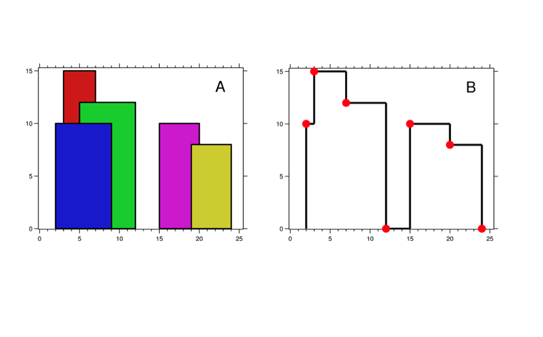

# BolVeFethetAlgoritmasi-DivideAndConquer
Bilgisayar biliminde parçala ve fethet (böl ve hükmet, divide and conquer) **çok dallı özyineleme tasarımına dayanan** bir algoritma türüdür. Bu yaklaşım, çözümü en basite indirgeneyene kadar problemi benzer alt problemlere kırmaya ve çözümleri tekrar birleştirmeye dayanır.
Bir parçala ve fethet algoritması üç bölümden oluşur:
- böl (divide): Problemi daha basit parçalara, alt problemlere böl.
- fethet (conquer): Alt problemleri özyinelemeli olarak çöz.
- birleştir (combine): Alt problemlerin çözümlerini birleştirerek orjinal problemin çözümüne ulaş.

Böl ve fethet mantığı ile çalışan bir algoritma türünü örnek olarak vermek gerekirse, birleştirme sıralaması (Merge Sort) verilebilir. Birleştirme Sıralaması içerisinde birçok kez kendini çağırarak çok daha ufak parçalara ayrılmış yapılar ile çözüme gitme yaklaşımını kullanmaktadır.
Bu projemde böl ve fethet algoritmasını **binaların gölge sınırlarını** almak için kullandım. Daha iyi kavrayabilmeniz için detaylandıracağım. Literatürde "Skyline Problemi" olarak da bilinen bu çalışma, arkasında güneş ışınları olan ve bu binaların sadece sınırları belli olan bir görüntüye dayanmaktadır. Böyle bir görüntüde sizden istenen binaların güneş sebebiyle oluşan koyu kısımlarını, yani aslında sınırlarını doğru bir şekilde ayırmanızdır. Aşağıdaki görsel ile ne demek istediğimi çok daha kolay bir şekilde anlayacaksınız.

Bu durumda bizden istenen çalışmayı ise aşağıdaki görselde daha net bir şekilde anlayabilirsiniz.

Son olarak konuyla ilgili literatürde çok fazla yerli kaynak bulunmamakta. Aramalarınızı "The Solution of Skyline Problem with Divide and Conquer" şeklinde yaparsanız sonuca daha hızlı varabilirsiniz.
